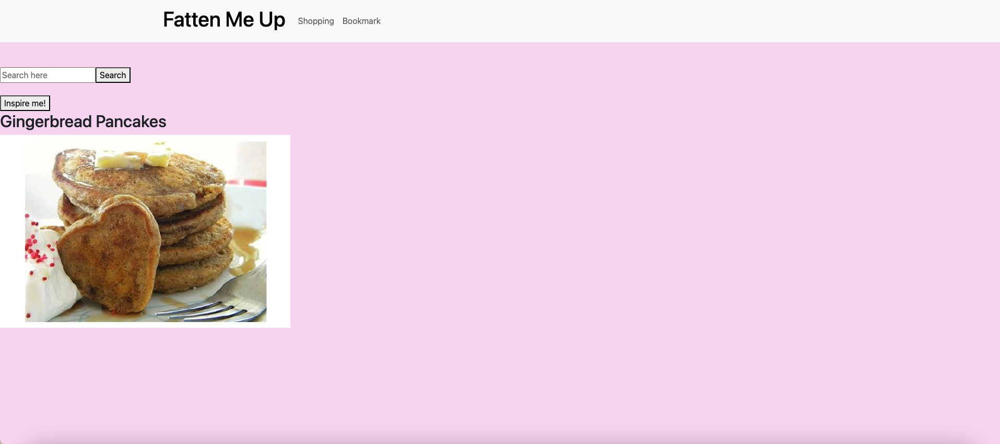
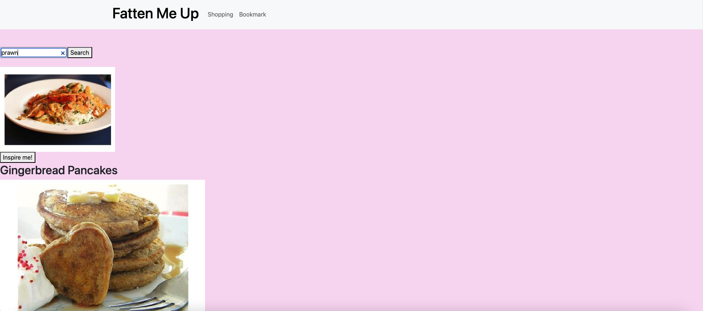
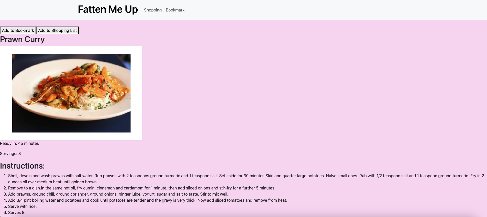
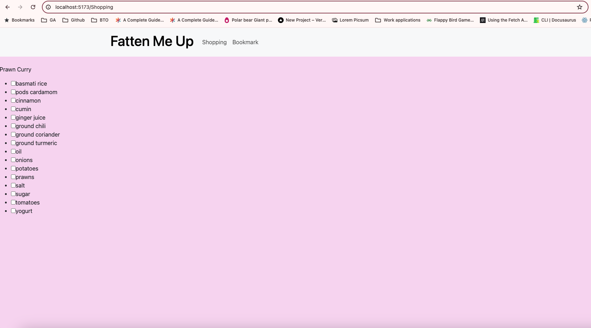
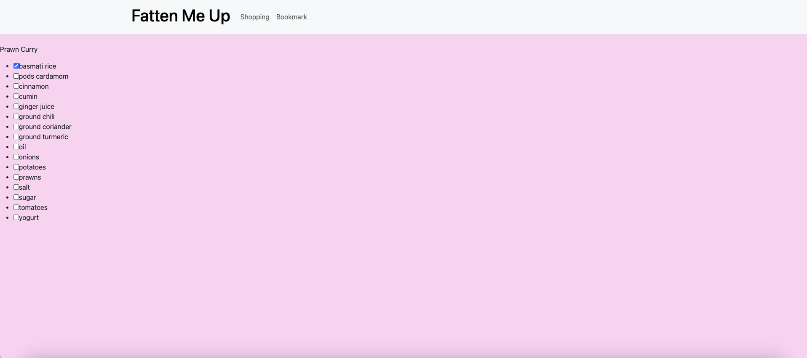
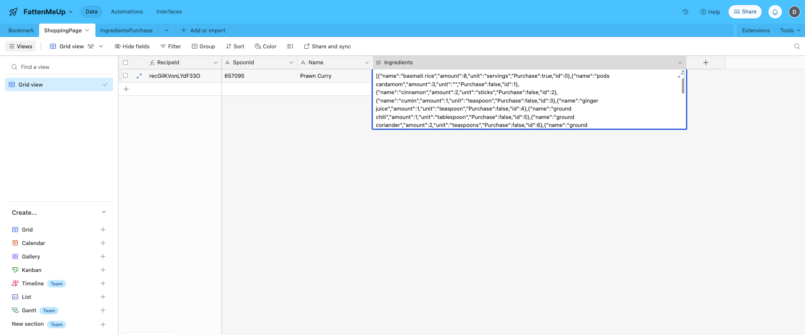
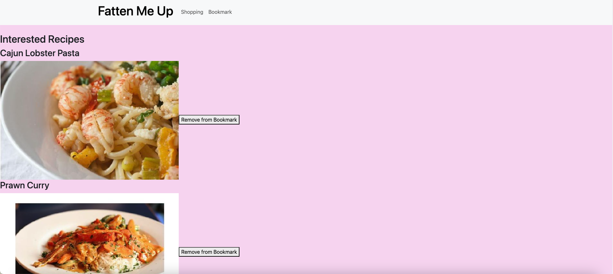

# Fatten Me Up

Visit [fatten-me-up.vercel.app](https://fatten-me-up.vercel.app/)

[Wireframe - Figma](<https://www.figma.com/file/qUC7Kg4BfIEcBdJvK68o4p/Fatten-Me-Up-(Project-2)?type=whiteboard&node-id=0%3A1&t=YzZLnIU0ItNZfzkh-1>)

[Trello Board](https://trello.com/invite/b/DtODau3m/ATTI92c49c5575eca9b4c1573541ee1bfb3bE13FF91B/fatten-me-up)

## Introduction

Ever felt like you are at a lost of what to eat and have no inspirations on dishes to cook? This app is here to solve your headaches, you can search for inspiration and add them to the shopping list! Saves you the trouble to remember the ingredients needed with a built in checklist to tick as you get your groceries needed.

## User Stories

As a user,

- I would like to be able to search for recipes with keywords that might give me some inspiration

- I would like to be able to add the ingredients that are needed to make the dish be available as a checklist for ease of dish preparation

- I would like a random recipe generated for days when I have no keywords inspiration

## Screenshots

**Home Page**

 

**Search Bar**

**Recipe Page**

**Shopping Page**

**Shopping List Checked**

**AirTable**

Airtable gets updated from Purchase:false to Purchase:true

**Bookmark Page**

## Wireframe

## Technologies Used

- JavaScript(React and Fetch API)
- HTML and CSS
- Powered by Spoonacular API and Airtable API

## Icebox

- Able to change the serving size and add to shopping list with the exact quantity needed
- Able to remove the shopping list with a button when user does not need that checklist anymore

## Challenges

- Spend alot of time researching on how to do a checklist with the details stored in airtable
